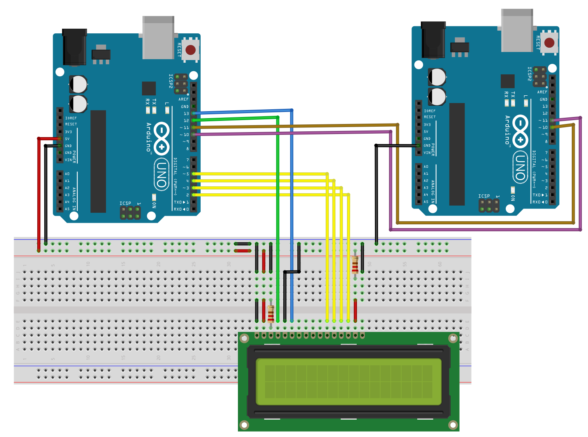
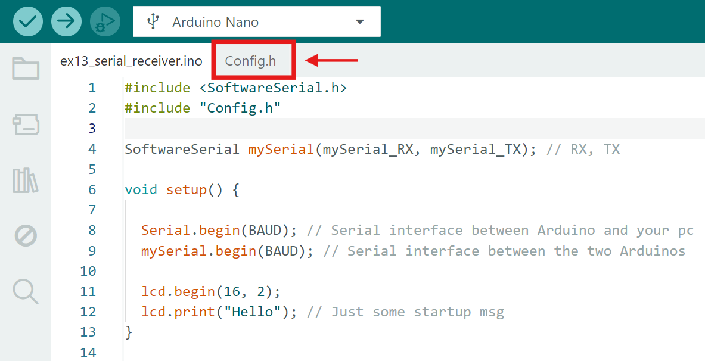
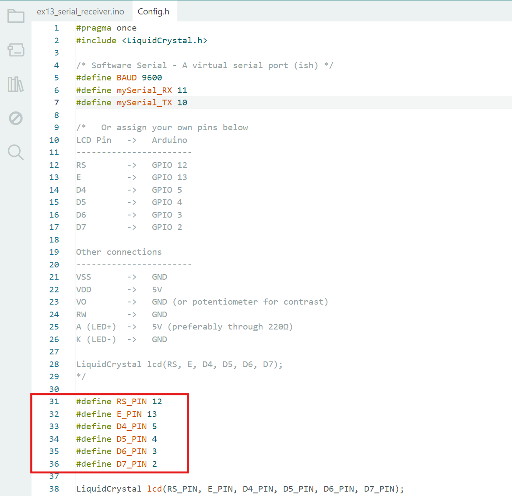

# Fritzing Schematic of the setup

# Livestock Monitor Prototype

# LCD to Arduino Wiring Guide

This guide shows how to connect a standard **16x2 LCD (HD44780 compatible)** to an **Arduino** using the `LiquidCrystal` library in **4-bit mode**.

---

## LCD Pin to Arduino Pin Mapping

| LCD Pin | Arduino GPIO |
|--------|--------------|
| RS     | GPIO 12 |
| E      | GPIO 13 |
| D4     | GPIO 5 |
| D5     | GPIO 4 |
| D6     | GPIO 3 |
| D7     | GPIO 2 |

---

## Other Required Connections

| LCD Pin | Connection |
|--------|------------|
| VSS | GND |
| VDD | 5V |
| VO  | GND *(or through a potentiometer for contrast control)* |
| RW  | GND |
| A (LED+) | 5V *(preferably through a 220Ω resistor)* |
| K (LED-) | GND |

---

## Change pins to your own

---

# Serial Communication Explanation

You type a message in the serial monitor: "hey"

1. "hey" is sent from your pc to the arduino via Serial  
2. "hey" is processed by the arduinos embedded code (i.e. it does what you told it to do). Lets say you've written code which changes the message "hey" to uppercase.  
3. The msg has been changed to "HEY", and is now sent to the other arduino via mySerial.

## Connections

Serial:  
PC <=> Arduino 1  

mySerial:  
Arduino 1 <=> Arduino 2  

## Notes

mySerial is an instance of SoftwareSerial.

UART is used for serial communication.

The Arduino UNO only has 1 Hardware UART port (TX/RX) (pin 0 and pin 1).

This hardware UART can also be used, but note that it is shared with USB.

"Shared with USB": It's the same Serial interface as "Serial.begin()".

Sharing it with "Arduino-to-Arduino communication" can pollute the Serial Monitor output.

---